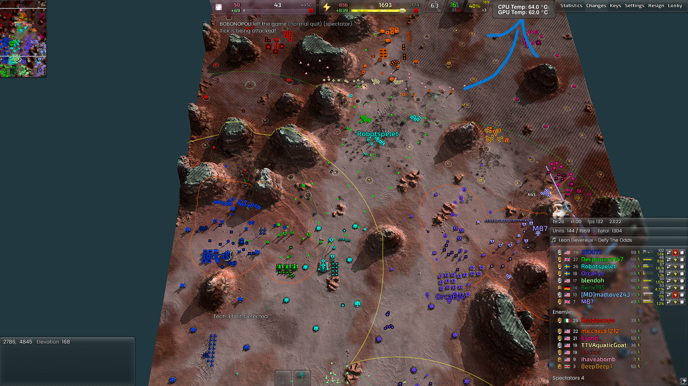
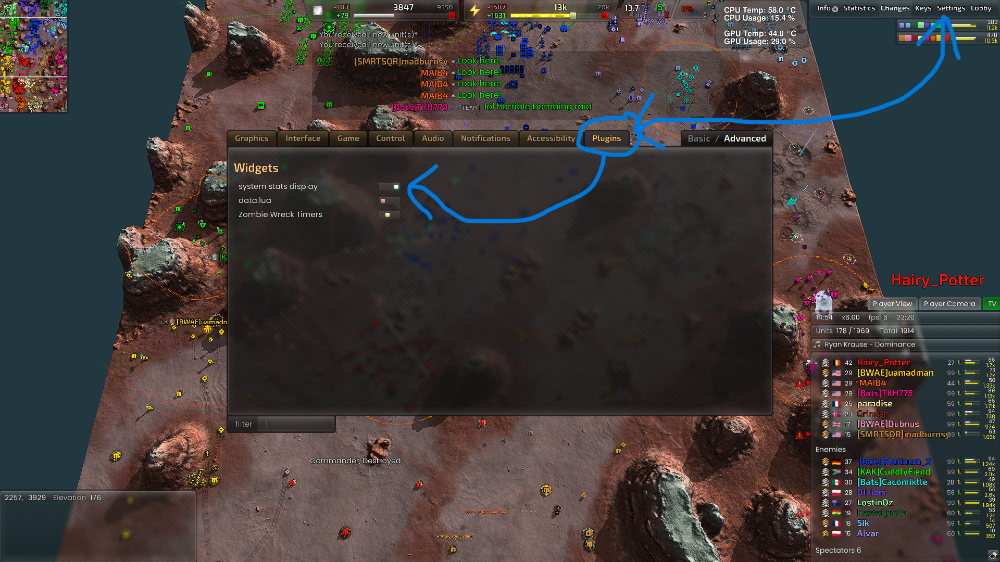

# Open-Stat-Dump-BAR_Widget -------------

This is a Beyond all reason gui widget that
displays system stats in game (NOT THE MENU/LOBBY)
it consumes the output from the Open-Stat-Dump program
can be found here 
```bash
https://github.com/DeclanFindlay/Open-Stat-Dump 
```

Beyond all reason can be found and downloaded here
```bash
https://www.beyondallreason.info/download
```

the repo can be found here 
```bash
https://github.com/beyond-all-reason/Beyond-All-Reason
```

# how to use Open-Stat-Dump-BAR_Widget -------------

simply place the gui_stats_widget.lua file in 
C:\Users\<YOUR_USER_NAME>\AppData\Local\Programs\Beyond-All-Reason\data\LuaUI\Widgets\
you will need to create the Widgets folder if it dose not exist already 

the game engine will read the file automatically from there

# IMPORTANT -------------

you will need to manualy change to your gpu type 
GPU TYPES -----
local GpuNvidia = "GpuNvidia"
local GpuIntel = "GpuIntel"
local GpuAmd = "GpuAmd"
GPU TYPES -----

find this code in gui_stats_widget.lua: 
```bash
-- change to your gpu type here 
GetMainGpuTemp(GpuNvidia) .. -- <------
```

note it is currently set to a nvidia gpu 

open-stat-dump setup:
make sure to set Open-Stat-Dump output location to the same location
as the gui_stats_widget.lua file 

and that you select the .lua file output option in Open-Stat-Dump
you also need to set the file name to data for gui_stats_widget.lua
to see it 

widget location adjustments:
you may need to adjust the panal coord to change the panal location on your screen 
eg. 
``` bash
local panel = {
    x1 = 1375,
    y1 = 1030,
    x2 = 1550,
    y2 = 1078,
    round = 6
}
```
it is currently set to fit on a 1920 x 1080 monitor you should see it around the top right 
<p>
    
</p>

also make sure the widget is actually enabled in game eg.
<p>
    
</p>

# License -------------

Open-Stat-Dump-BAR_Widget is under the MIT License check the License file for more information 
